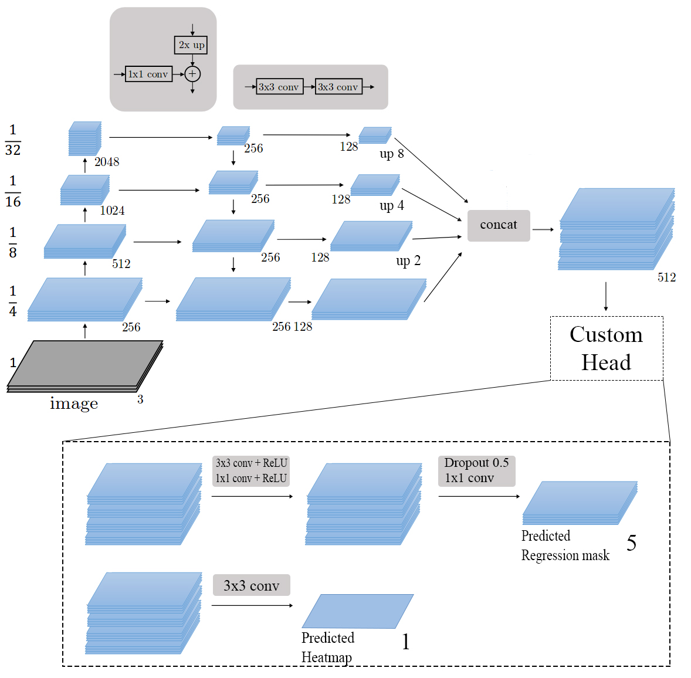

# Abstract

A conceptually simple framework for six degrees of freedom (6DoF)
object pose estimation, especially for autonomous driving
scenario.

The following approach is based on an anchor free model that detects traffic participants while simultaneously regressing their pose. Our model works only with RGB images, differently from other approaches that use also LIDAR information. The architecture presented in this paper is faster to train end-to-end because uses less information, and it slightly improves the state of art.
This is because the inclusion of translational regression in the joint losses is crucial for the 6DoF pose estimation task, where object translation distance along longitudinal axis varies significantly, e.g., in autonomous driving scenario.

The model, called VPPNet that stands for Vehicle Pose Pyramidal Network, starts from the idea of object as a point, and builds upon this idea a new framework based on a pyramidal network. It has two custom heads for predicting vehicle’s center rotation and translation, the vehicle's class is not important for the task but it can be easily added. 

I won the silver medal on kaggle's competition using the presented approach. 

Full paper <a href ="https://drive.google.com/file/d/1_KZNVUnvR3nLEgQB7_M46aQFOJtuqMpr/view?usp=sharing"> here</a>.

---

## Net overview

---

## Predictions example

